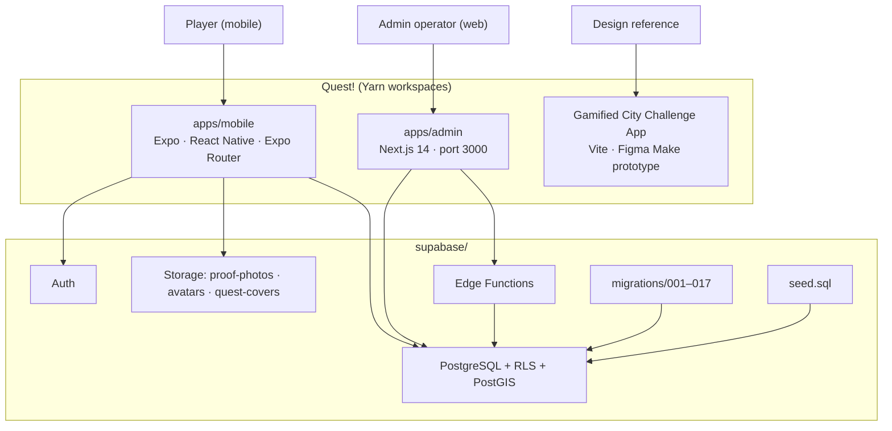
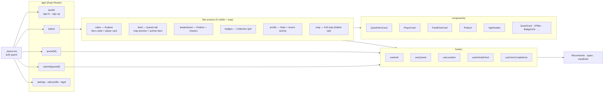
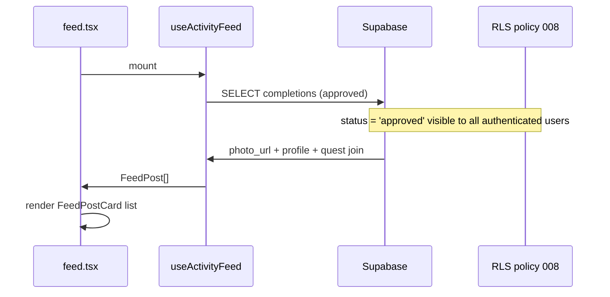
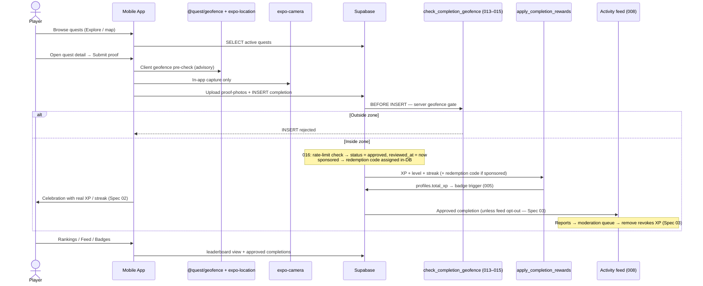
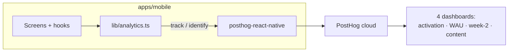
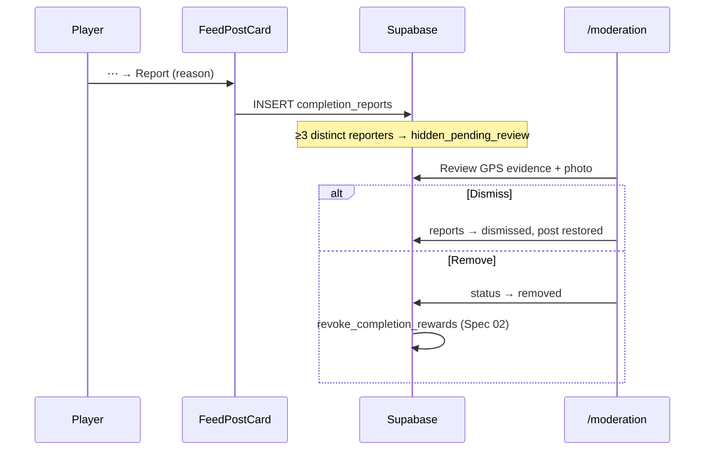

# Quest! Architecture

Visual map of the codebase — a monorepo for a gamified city quest app with two clients, a Figma web prototype, and a Supabase backend.

## High-level architecture



## Mobile app structure



## Activity feed data flow



Requires migrations `008` (public feed RLS) and `017` (replaces the policy: feed now excludes `hidden_pending_review` posts and profiles with `feed_public = false`; client also filters blocked users).

## Geofence system (migrations 013–015)

Four zone types, all enforced **server-side** by a `BEFORE INSERT` trigger on `completions` — the mobile client's "inside quest zone" indicator is advisory UX only.

| Type | Meaning | Validation |
|---|---|---|
| `none` | Submit from anywhere (home/reflective quests) | Always passes |
| `circle` | Radius around a point (50–2000 m) | `ST_DWithin` + GPS-accuracy buffer (≤30 m) |
| `city` | Anywhere inside the city boundary | `ST_Covers` against `cities.boundary` |
| `polygon` | Hand-drawn perimeter (admin ✏️ Draw mode) | `ST_DWithin` against `quests.boundary` + accuracy buffer |

Shape data flows to clients via the generated `quests.boundary_geojson` column (plain `select *`, no RPC). The admin writes boundaries through the validated `set_quest_boundary()` function (3–100 vertices, 400 m²–250 km², self-intersection repair). Client-side mirror logic lives in the shared `packages/geofence` package (44 tests).

## Core quest flow — instant verification (shipped)

**Geofence pass = proof.** Completions auto-approve at insert (migration `016`); XP, level, streak, and sponsored redemption codes land before the celebration modal renders. Community reports + admin moderation (migration `017`) replace the old approval queue. Specs: [02](docs/specs/02-instant-verification.md) + [03](docs/specs/03-report-moderation.md).



Anti-abuse at the same layer: rate limits (2 per 10 min, 10 per 24 h) in the `BEFORE INSERT` trigger, in-app camera only, Android mock-location block client-side.

## System map (specs 01–07)

| System | Spec | Status | Touches |
|---|---|---|---|
| Geofence drawing | [01](docs/specs/01-geofence-drawing.md) | ✅ Shipped (014–015) | `quests.boundary`, admin ✏️ Draw mode, `@quest/geofence` |
| Instant verification | [02](docs/specs/02-instant-verification.md) | ✅ Shipped (016) | `completions` insert path, mobile celebration, admin queue → log |
| Reports & moderation | [03](docs/specs/03-report-moderation.md) | ✅ Shipped (017) | `FeedPostCard` + `ReportPostSheet`, `/moderation`, feed RLS, `removed` status, `feed_public`, `blocked_users` |
| Analytics | [04](docs/specs/04-analytics-instrumentation.md) | Planned | `lib/analytics.ts`, PostHog in `_layout.tsx` |
| Content engine | [05](docs/specs/05-community-quests.md) | Planned | `quest_suggestions`, weekly drops (012), `quest_chains` |
| Growth & engagement | [06](docs/specs/06-growth-engagement.md) | Planned | duo parties, recap share card, `xp_events`, offline queue |
| Merchant redemption | [07](docs/specs/07-merchant-redemption.md) | Planned (`redeemed_at` already landed in 016) | `/redeem/[merchantKey]`, `sponsors` |

Index and dependency order: [docs/specs/README.md](docs/specs/README.md). Product rationale: [PRODUCT.md](PRODUCT.md), phase plan: [ROADMAP.md](ROADMAP.md).

## Folder tree

```
Quest!/
├── apps/
│   ├── mobile/              Expo app (player-facing)
│   │   ├── app/(tabs)/      index, feed, leaderboard, badges, profile, map
│   │   ├── components/      QuestHeroCard, PlayerCard, Podium, FeedPostCard, …
│   │   ├── hooks/           useAuth, useQuests, useActivityFeed, …
│   │   └── lib/             constants.ts, types, supabase (+ analytics.ts — Spec 04)
│   └── admin/               Next.js dashboard
│       └── app/             completions (log), moderation, quests, users, sponsors
│                            (+ suggestions, redeem — specced)
├── packages/
│   └── geofence/            @quest/geofence — shared client geofence logic (44 tests)
├── docs/specs/              01–07 feature specs (instant verification era)
├── Gamified City Challenge App/   Figma Make web prototype
├── tokens/                  Shared CSS design tokens
├── DESIGN.md                Harbour Electric design system
├── PRODUCT.md               Product positioning, content engine, safety
├── ROADMAP.md               Phase plan and status
└── supabase/
    ├── migrations/          001–017 (geofence 013–015 · instant verification 016 · moderation 017)
    ├── functions/           snapshot-ranks (award-xp + generate-redemption-code retired by 016)
    └── seed.sql
```

## Design system alignment

| Layer | Location |
|-------|----------|
| Spec | `DESIGN.md` |
| Mobile tokens | `apps/mobile/lib/constants.ts` |
| Web prototype tokens | `Gamified City Challenge App/src/styles/theme.css` |
| Shared CSS | `tokens/colors.css`, `typography.css`, `shadows.css` |

Prior spec (**Saltwater Saturday**, indigo `#6366F1`, 4-tab layout) is superseded as of June 2026 Figma reimagining.

## Analytics data flow (Spec 04 — planned)



No server-side event forwarding in v1. Sponsor redemption counts come from Postgres (Spec 07), not PostHog.

## Moderation data flow (Spec 03 — shipped, migration 017)



Feed privacy opt-out (`profiles.feed_public`, toggle in Settings) and block-user filtering (`blocked_users` + `useBlockedUsers`) shipped in the same migration. Removal notifies the owner via `apps/admin/lib/expo-push.ts`.
