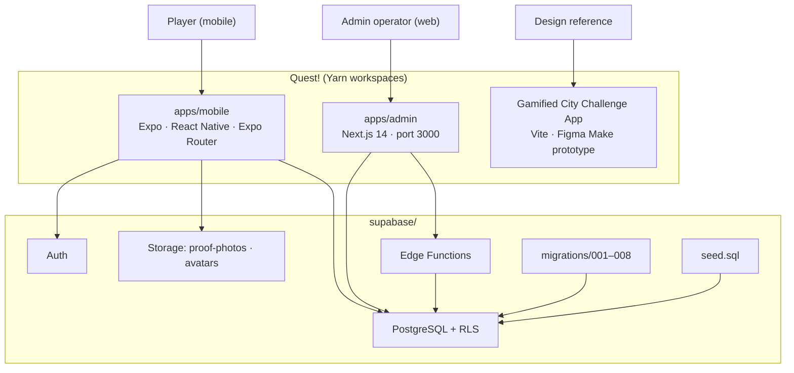
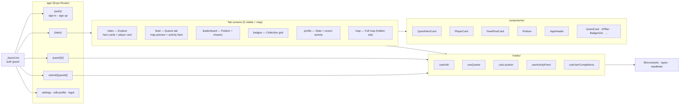
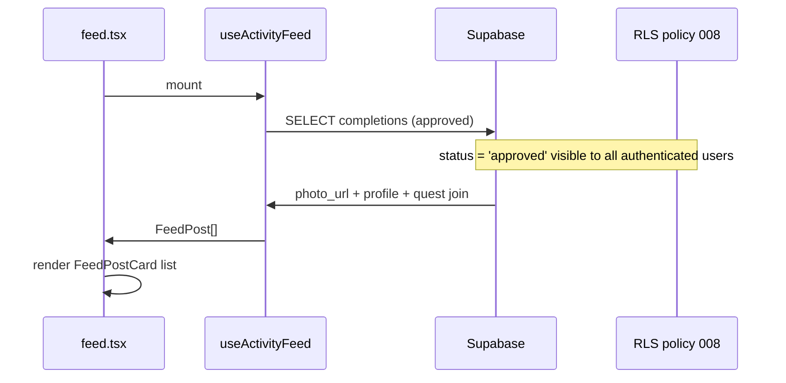
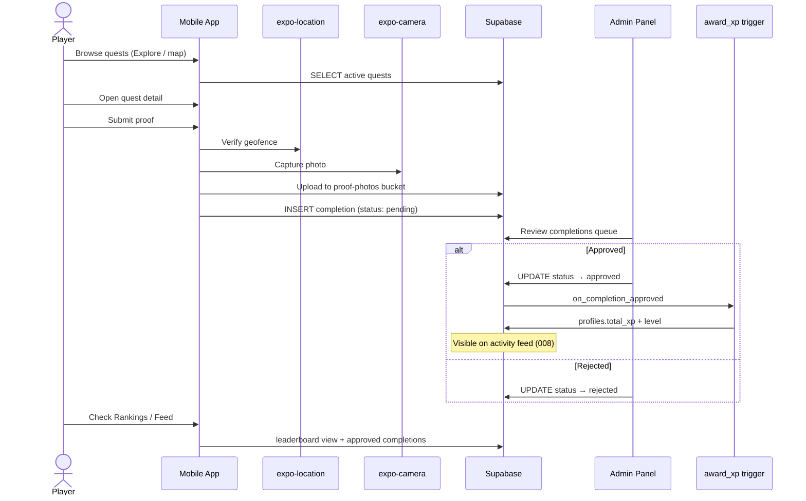

# Quest! Architecture

Visual map of the codebase — a monorepo for a gamified city quest app with two clients, a Figma web prototype, and a Supabase backend.

## High-level architecture



## Mobile app structure



## Activity feed data flow



Requires migration `008_public_feed_completions.sql`.

## Core quest flow



## Folder tree

```
Quest!/
├── apps/
│   ├── mobile/              Expo app (player-facing)
│   │   ├── app/(tabs)/      index, feed, leaderboard, badges, profile, map
│   │   ├── components/      QuestHeroCard, PlayerCard, Podium, FeedPostCard, …
│   │   ├── hooks/           useAuth, useQuests, useActivityFeed, …
│   │   └── lib/             constants.ts (design tokens), types, supabase
│   └── admin/               Next.js dashboard
├── Gamified City Challenge App/   Figma Make web prototype
├── tokens/                  Shared CSS design tokens
├── DESIGN.md                Harbour Electric design system
└── supabase/
    ├── migrations/          001–008
    ├── functions/           award-xp, generate-redemption-code
    └── seed.sql
```

## Design system alignment

| Layer | Location |
|-------|----------|
| Spec | `DESIGN.md` |
| Mobile tokens | `apps/mobile/lib/constants.ts` |
| Web prototype tokens | `Gamified City Challenge App/src/styles/theme.css` |
| Shared CSS | `tokens/colors.css`, `typography.css`, `shadows.css` |

Prior spec (**Saltwater Saturday**, indigo `#6366F1`, 4-tab layout) is superseded as of June 2026 Figma reimagining.
